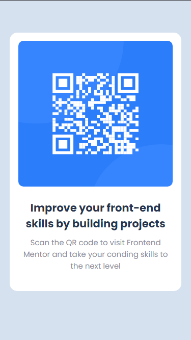
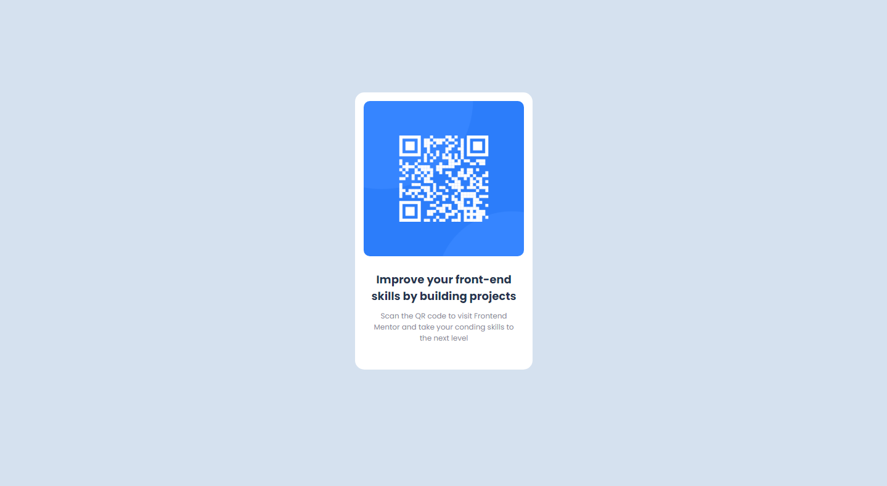

## Overview

### Screenshot

; 

; 

## My process

### Built with

- Semantic HTML5 markup
- CSS custom properties
- Flexbox
- Media Queries

### What I learned

I've learned again how to use flexbox

### Continued development

I need learn more on how to layout besides flexbox. I also need to learn the basics of media queries

## Author

- Github - [ZhYrYL](https://github.com/ZhYrYL)
- Frontend Mentor - [@ZhYrYL](https://www.frontendmentor.io/profile/ZhYrYL)

